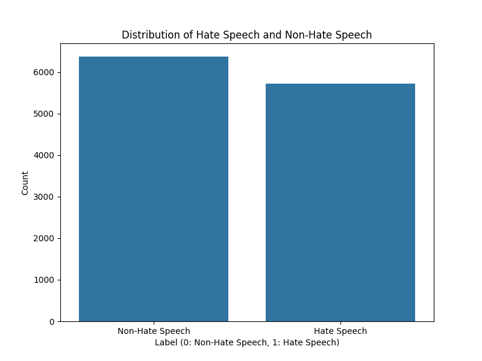
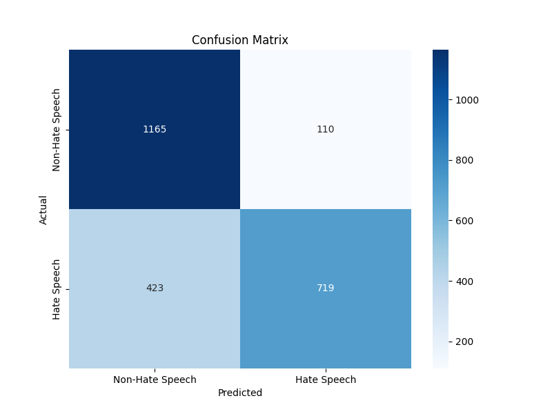
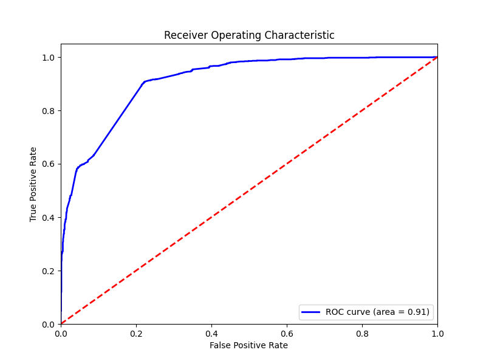

# Hate Speech Detection API

## Overview
This project implements a machine learning model to classify text as hate speech or non-hate speech specifically in the Tunisian dialect. The model is built using the Naive Bayes algorithm and utilizes the Count Vectorizer for text feature extraction. The API is built with Flask and provides endpoints for making predictions.


## Table of Contents
- [Installation](#installation)
- [Usage](#usage)
- [API Endpoints](#api-endpoints)
- [Example Usage](#example-usage)
- [Visualizations](#visualizations)
- [Performance Metrics](#performance-metrics)
- [Data](#data)
- [Contributing](#contributing)
- [License](#license)

## Installation
To run this project, ensure you have Python 3.x installed. Follow these steps to set up the environment:

1. Clone the repository:
   ```bash
   git clone https://github.com/mahdibenabd/ate-speech-detection-api.git
   cd hate-speech-detection-api
   ```

2. Create a virtual environment (optional but recommended):
   ```bash
   python -m venv venv
   source venv/bin/activate  # On Windows use `venv\Scripts\activate`
   ```

3. Install the required packages:
   ```bash
   pip install -r requirements.txt
   ```

## Usage
1. **Train the Model**:
   Run the following command to train the model and save it:
   ```bash
   python src/enhanced_model.py
   ```

2. **Adjust the Classification Threshold**:
   Run the following command to optimize the classification threshold:
   ```bash
   python src/threshold_adjustment.py
   ```

3. **Start the Flask API**:
   Run the following command to start the API:
   ```bash
   python src/app.py
   ```

4. **Test the API**:
   You can test the API using `curl` or any API testing tool (like Postman). Here’s an example `curl` command:
   ```bash
   curl -X POST http://127.0.0.1:5000/predict -H "Content-Type: application/json" -d "{\"message\": \"أنت كذاب\"}"
   ```

## API Endpoints
- **POST /predict**: Predicts whether the input text is hate speech or not.
  - **Request Body**:
    ```json
    {
      "message": "Your text here"
    }
    ```
  - **Response**:
    ```json
    {
      "is_hate_speech": true/false
    }
    ```
## Example Usage
### Using React.js
You can also create a simple React component to interact with the API. Below is an example of how to implement this:

1. **Install Axios**:
   ```bash
   npm install axios
   ```

2. **Create a Component**:
   Create a file named `HateSpeechDetector.js` and add the following code:
   ```javascript
   import React, { useState } from 'react';
   import axios from 'axios';

   const HateSpeechDetector = () => {
       const [message, setMessage] = useState('');
       const [result, setResult] = useState(null);
       const [error, setError] = useState('');

       const handleSubmit = async (e) => {
           e.preventDefault();
           setError('');
           setResult(null);

           try {
               const response = await axios.post('http://127.0.0.1:5000/predict', {
                   message: message,
               });
               setResult(response.data.is_hate_speech);
           } catch (err) {
               setError('Error: Unable to reach the API');
               console.error(err);
           }
       };

       return (
           <div>
               <h1>Hate Speech Detector</h1>
               <form onSubmit={handleSubmit}>
                   <textarea
                       value={message}
                       onChange={(e) => setMessage(e.target.value)}
                       placeholder="Enter your message here"
                       rows="4"
                       cols="50"
                   />
                   <br />
                   <button type="submit">Check for Hate Speech</button>
               </form>
               {result !== null && (
                   <div>
                       <h2>Result:</h2>
                       <p>{result ? 'This message is hate speech.' : 'This message is not hate speech.'}</p>
                   </div>
               )}
               {error && <p style={{ color: 'red' }}>{error}</p>}
           </div>
       );
   };

   export default HateSpeechDetector;
   ```   
## Visualizations
### Class Distribution

This figure shows the distribution of hate speech and non-hate speech examples in the dataset.

### Word Clouds

These word clouds display the most common words in hate speech and non-hate speech categories.

### Confusion Matrix

The confusion matrix illustrates the performance of the classification model, showing true positives, true negatives, false positives, and false negatives.

### ROC Curve

The ROC curve shows the trade-off between the true positive rate and false positive rate at various threshold settings.

## Data
The dataset used for training and testing the model is `HateTunisianData.csv`, which contains phrases labeled as hate speech (1) or non-hate speech (0). 

## Performance Metrics

The following table summarizes the key performance metrics for the hate speech detection model, based on the evaluation of the test dataset.

| Metric          | Precision | Recall | F1-Score | Support |
|-----------------|-----------|--------|----------|--------|
| (0) Non-Hate Speech | 0.7353    | 0.9129 | 0.8146   | 1275   |
|(1) Hate Speech     | 0.8669    | 0.6331 | 0.7318   | 1142   |
| **Accuracy**    | **0.7807**|        |          |        |
| **Macro Avg**   | 0.8011    | 0.7730 | 0.7732   | 2417   |
| **Weighted Avg**| 0.7975    | 0.7807 | 0.7754   | 2417   |

### Explanation of Metrics
- **Precision**: The ratio of correctly predicted positive observations to the total predicted positives. It indicates how many of the predicted hate speech instances were actually hate speech.
- **Recall**: The ratio of correctly predicted positive observations to all actual positives. It indicates how many of the actual hate speech instances were correctly identified.
- **F1-Score**: The weighted average of Precision and Recall. It provides a balance between the two metrics.
- **Support**: The number of actual occurrences of the class in the specified dataset.

### Accuracy
The overall accuracy of the model is **78.07%**, indicating that the model correctly classifies approximately 78% of the instances in the test dataset.

### Averages
- **Macro Average**: The average performance across all classes, treating all classes equally.
- **Weighted Average**: The average performance across all classes, weighted by the number of instances in each class.

### Adding Data
To add new data for training:
1. Ensure the data is in CSV format.
2. The CSV should have two columns: one for the text `hatespeech` and one for the label `index` (0 for non-hate speech, 1 for hate speech).
3. Update the `HateTunisianData.csv` file in the `data/` directory.

## Contributing
Contributions are welcome! Please feel free to submit a pull request or open an issue for any suggestions or improvements.

## License
This project is licensed under the MIT License - see the [LICENSE](LICENSE) file for details.